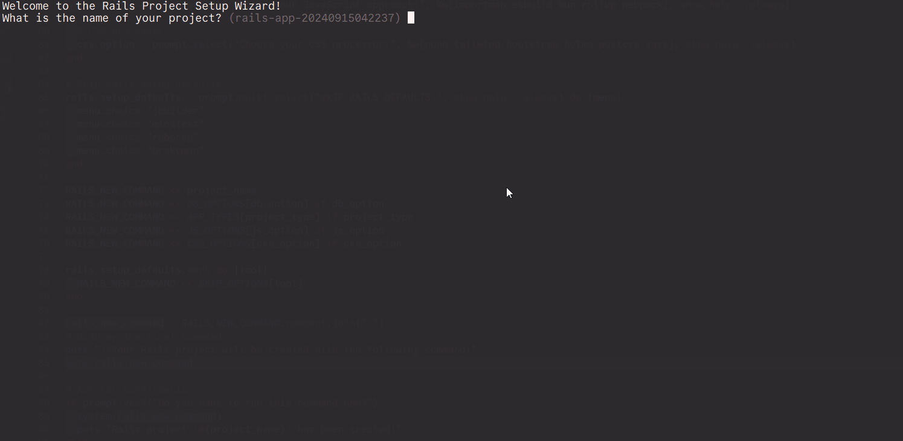

# LazyRails

LazyRails simplifies Rails project creation and tool installation, addressing two common pain points:

1. Simplifying the verbose command for creating new Rails apps.
2. Customizing the default tools installed with a new Rails project.

## Features

- Interactive guide for creating new Rails projects
- On-the-fly addition and installation of popular gems and tools. No more open documentation and copy-paste commands.

## Installation


Install globally:
```bash
gem install lazy_rails
```

## Usage

Create a new Rails project:
```bash
lazy_rails new
```



## Development

1. Clone the repo: `git clone https://github.com/[USERNAME]/lazy_rails.git`
2. Install dependencies: `bin/setup`
3. Run tests: `rake spec`
4. Start console: `bin/console`

Local installation: `bundle exec rake install`

## Roadmap

- [ ] test compatibility with other ruby/rails versions
- [ ] Selection of Rails version (at least last 3)
- [ ] View template selection (ERB, Haml, Slim)
- [ ] Test tool selection (RSpec, Minitest, Test::Unit)
- [ ] Linter selection (RuboCop, Standard)
- [ ] Basic setup customization (Action Cable, Active Job, Action Mailer, Action Mailbox)
- [ ] On-the-fly popular gem installation (Devise, Sidekiq, Solid Queue)
- [ ] Improve documentation
- [ ] Enhance error handling and user feedback

✅ Completed:
- [x] Basic CLI structure
- [x] 'new' command for project generation
- [x] CSS processor selection (Tailwind, Bootstrap, Bulma, PostCSS, Sass)
- [x] JavaScript processor selection (Importmap, Bun, Webpack, esbuild, Rollup)
- [x] Database selection (SQLite3, MySQL, PostgreSQL)
- [x] Increase test coverage
- [x] App type selection (API, Web)

## Contributing

Contributions are welcome! See [CONTRIBUTING.md](CONTRIBUTING.md) for details.

## License

This gem is available as open source under the [MIT License](https://opensource.org/licenses/MIT).

## Thanks

- [Rails](https://github.com/rails/rails) - The web framework that inspired this gem
- [Thor](https://github.com/rails/thor) - The toolkit for building powerful command-line interfaces
- [@piotrmurach](https://github.com/piotrmurach) for [tty-prompt](https://github.com/piotrmurach/tty-prompt)
- [@excid3](https://github.com/excid3) for inspiration and guidance
- The entire Rails community workers for their continuous contributions and support

---

This is my first gem as a Ruby/Rails developer. Sorry for  very possible bugs.
Feedback and contributions are appreciated!
